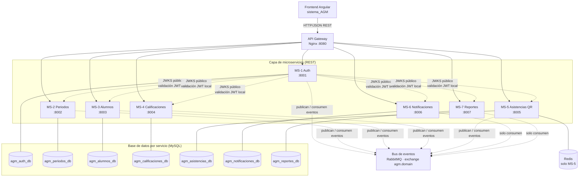
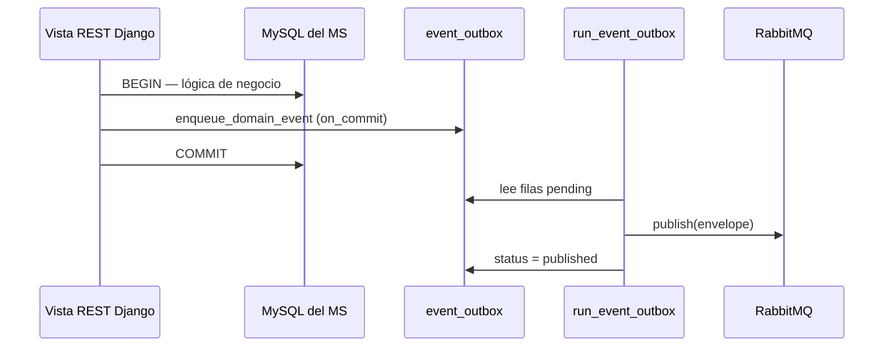
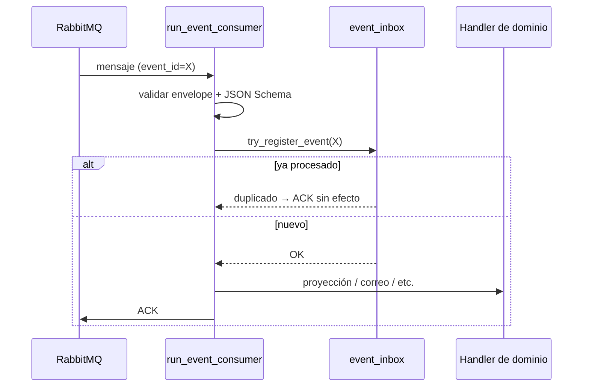

# AGM — Documentación para exposición

**Sistema:** Academic Grade Management (AGM) — FCC-BUAP  
**Stack:** Angular 20 · Nginx (API Gateway) · 7 microservicios Django/DRF · MySQL (una BD por MS) · RabbitMQ · Redis (solo MS-5)

Este documento resume tres bloques para la presentación: **mapa de la aplicación**, **bus de eventos (outbox/inbox)** y **contratos Protocol Buffers**.

---

## 1. Mapa de la aplicación

### 1.1 Vista general (como el diagrama del pizarrón)

El sistema sigue el patrón clásico de microservicios: el cliente solo habla con un punto de entrada; cada servicio tiene su propia base de datos; la integración entre dominios no cruza BDs, sino que pasa por un **bus de mensajes**.



**Lectura del diagrama (de arriba hacia abajo):**

| Capa | Qué hace | Por qué importa |
|------|----------|-----------------|
| **Frontend** | UI para admin, docente y alumno | No conoce los 7 puertos internos; solo llama al gateway |
| **API Gateway (Nginx)** | Enruta `/auth/`, `/periodos/`, `/alumnos/`, etc. | Un solo origen (`localhost:8080`); regla **R2** del proyecto |
| **Microservicios** | Lógica de negocio REST + workers del bus | Cada MS es un proceso Docker independiente |
| **RabbitMQ** | Integración **asíncrona** entre dominios | Sustituye llamadas gRPC síncronas en el flujo principal (Fase 9) |
| **MySQL × 7** | Persistencia **privada** por MS | Regla **R1**: nadie lee la BD de otro MS |
| **Redis** | Sesiones QR, anti-replay, TTL corto | Estado efímero en MS-5 sin contaminar otras BDs |

### 1.2 Rutas del gateway (lo que ve el frontend)

| Prefijo público (`:8080`) | Microservicio | Ejemplos de uso |
|---------------------------|---------------|-----------------|
| `/auth/`, `/usuarios` | MS-1 | Login, JWT, recuperar contraseña |
| `/periodos/`, `/materias/` | MS-2 | Periodos activos, catálogo de materias |
| `/docentes/`, `/alumnos/` | MS-3 | Importar alumnos, bajas |
| `/ponderaciones`, `/actividades`, `/calificaciones` | MS-4 | Notas y concentrado |
| `/sesiones`, `/asistencias` | MS-5 | QR de asistencia |
| `/notificaciones` | MS-6 | Pruebas/admin de correo |
| `/reportes`, `/estadisticas` | MS-7 | PDF/Excel, dashboards |

Configuración: `docker/nginx/default.conf`.

### 1.3 Responsabilidad de cada microservicio

| MS | Nombre | Rol principal | En el bus |
|----|--------|---------------|-----------|
| **MS-1** | Auth & Users | Login, JWT RS256, usuarios, JWKS | **Publica** identidad (`user.*`, `token.revoked.v1`); **consume** `user.create_requested.v1` |
| **MS-2** | Periodos & Materias | Periodos, materias, importación PDF | **Publica** `periodo.*`, `materia.*` |
| **MS-3** | Docentes & Alumnos | Import Excel/PDF, inscripciones | **Publica** `alumno.*`, `docente.*`; pide usuarios a MS-1 por evento |
| **MS-4** | Calificaciones | Ponderaciones, actividades, notas | **Proyecciones** locales de MS-2/3; **publica** eventos de calificaciones |
| **MS-5** | Asistencias QR | Sesiones QR + Redis | **Proyecciones**; **publica** `asistencia.*`, `qr.session.*` |
| **MS-6** | Notificaciones | SMTP, historial de correos | **Solo consumidor** — reacciona a eventos con envío async |
| **MS-7** | Reportes & Stats | Reportes y estadísticas | **Solo consumidor** — mantiene tablas analíticas locales |

### 1.4 Ejemplo de flujo punta a punta (para narrar en la expo)

**Caso:** el docente importa alumnos en una materia (MS-3).

1. El navegador hace `POST /alumnos/importar/...` → **Nginx** → **MS-3**.
2. MS-3 guarda alumnos en **su** MySQL y, en la misma transacción, encola eventos en **`event_outbox`** (`alumno.imported.v1`, y si aplica `user.create_requested.v1`).
3. El worker **`run_event_outbox`** de MS-3 publica en **RabbitMQ** (`agm.domain`).
4. **MS-1** consume `user.create_requested.v1` → crea credencial → publica `user.created.v1`.
5. **MS-4, MS-5, MS-7** actualizan **proyecciones** locales (copia reducida de datos que necesitan).
6. **MS-6** consume `alumno.imported.v1` → arma el correo de bienvenida → SMTP.

El usuario ve respuesta HTTP en cuanto MS-3 termina; correos y proyecciones llegan **unos segundos después** (consistencia eventual).

Evidencia detallada: `docs/EVIDENCIA_BUS_E2E.md`.

### 1.5 Reglas arquitectónicas (memoria rápida)

| ID | Regla |
|----|--------|
| R1 | Una BD MySQL por MS — sin acceso cruzado |
| R2 | Clientes externos solo por Nginx |
| R3 | Integración entre MS solo por RabbitMQ + eventos |
| R4 | Sin gRPC en flujos de negocio (`USE_EVENT_BUS=true`) |
| R6 | JWT validado localmente con JWKS de MS-1 |
| R7 | Consumidores idempotentes → tabla `event_inbox` |
| R8 | Productores transaccionales → tabla `event_outbox` |

---

## 2. Bus de eventos: RabbitMQ, Outbox, Inbox, TTL y DLQ

### 2.1 ¿Por qué un bus y no llamadas directas?

Antes (diseño académico inicial) los MS se llamaban por **gRPC** en tiempo real. Eso acopla disponibilidad: si MS-6 cae, MS-3 podría fallar al importar alumnos.

Con el bus (**Fase 9**):

- El productor **no espera** a que todos los consumidores terminen.
- Cada consumidor procesa a su ritmo.
- Se pueden **reintentar** fallos sin perder el mensaje original.
- Los duplicados se controlan con **inbox** (idempotencia).

Variable global: `USE_EVENT_BUS=true` (`.env` raíz y cada `ms-*/.env`).

### 2.2 Topología RabbitMQ

| Elemento | Valor | Descripción |
|----------|--------|-------------|
| **Exchange** | `agm.domain` | Tipo **topic**, durable |
| **Routing key** | = `event_name` | Ej. `alumno.imported.v1` |
| **Cola principal** | `ms-{servicio}.events` | Donde el worker consume |
| **Cola retry** | `ms-{servicio}.events.retry` | Backoff con **TTL** (~30 s) |
| **DLQ** | `ms-{servicio}.events.dlq` | Mensajes fallidos definitivos |

> **Nota sobre “LAT”:** en el código y runbooks del proyecto no hay un componente llamado “LAT”. En operación del bus lo habitual es hablar de **TTL** (tiempo en cola retry), **latencia** del procesamiento asíncrono y **DLQ**. En la expo puedes decir: *“el mensaje espera en retry con TTL y, si agota reintentos, va a la DLQ”*.

### 2.3 El sobre del mensaje (envelope)

Todo evento comparte la misma envoltura JSON (`contracts/events/_envelope.schema.json`):

| Campo | Uso |
|-------|-----|
| `event_id` | UUID único — clave de idempotencia en inbox |
| `event_name` | Nombre versionado, ej. `materia.closed.v1` |
| `aggregate_type` / `aggregate_id` | Entidad de negocio afectada |
| `source_service` | Quién publicó (`ms-alumnos`, etc.) |
| `correlation_id` | Trazar toda una operación de usuario |
| `causation_id` | Evento que causó este evento (cadena) |
| `occurred_at` | Timestamp UTC del hecho |
| `payload` | Datos validados con `{event_name}.schema.json` |

Librería compartida: `packages/agm_events/` (`envelope.py`, `publisher.py`, `consumer.py`, `validation.py`).

### 2.4 Patrón Transactional Outbox (productores — R8)

**Problema que resuelve:** si guardas en MySQL y publicas directo a RabbitMQ, puede fallar una de las dos cosas y quedar inconsistente (dato guardado sin evento, o evento sin dato).

**Solución:**



Pasos concretos en código (ej. MS-1):

1. `enqueue_domain_event(...)` construye el envelope y programa un `INSERT` en `event_outbox` con **`transaction.on_commit`** — solo si la transacción de negocio fue exitosa.
2. El comando `python manage.py run_event_outbox` (contenedor `*-outbox-worker`) lee `pending`, publica y marca `published`.
3. Si RabbitMQ está caído, las filas quedan `pending` y se reenvían al recuperar el broker (prueba de humo Fase 1).

Estados típicos en `event_outbox`: `pending` → `published` (o `failed` tras agotar reintentos de publicación).

### 2.5 Patrón Inbox (consumidores — R7)

**Problema que resuelve:** RabbitMQ puede entregar el **mismo mensaje más de una vez** (reconexión, reintento, at-least-once delivery).

**Solución:**



En MS-6, por ejemplo: `try_register_event` → si es nuevo, encola el envío SMTP en un worker interno (`mail_worker`) para no bloquear el consumer.

**Garantía:** el mismo `event_id` produce **un solo** efecto de negocio (un correo, una fila de proyección, etc.).

### 2.6 Reintentos, TTL y DLQ

Cuando un handler falla (SMTP caído, error temporal de BD):

1. El consumer **no hace ACK** o rechaza el mensaje hacia la cola **`.retry`**.
2. La cola retry tiene **`x-message-ttl`** (p. ej. 30 000 ms): el mensaje “duerme” y luego vuelve a la cola principal vía dead-letter.
3. Tras `EVENT_CONSUME_MAX_RETRIES` (env, típicamente 3), el mensaje va a **`ms-{x}.events.dlq`**.
4. Operación manual: inspeccionar en RabbitMQ Management (`:15672`) y reprocesar según `docs/runbooks/EVENT_BUS_OPERATIONS.md`.

### 2.7 Proyecciones locales (datos sin cruzar BDs)

MS-4, MS-5 y MS-7 **no consultan** la BD de MS-2 o MS-3. En su lugar mantienen tablas como:

- `materia_projection`, `periodo_projection`, `user_projection`, …
- `reporte_*_projection` en MS-7

Se actualizan **solo** al consumir eventos (`periodo.created.v1`, `alumno.imported.v1`, etc.). Es el patrón **Database per Service + réplica local eventual**.

### 2.8 Workers en Docker Compose

| Worker | Función |
|--------|---------|
| `ms-*-outbox-worker` | MS-1, 2, 3, 4, 5 — relay outbox → RabbitMQ |
| `ms-*-event-consumer` | MS-1, 4, 5, 6, 7 — consume cola y ejecuta handlers |

Catálogo completo de eventos y quién publica/consume: `contracts/events/CATALOG.md`.

### 2.9 Catálogo resumido de eventos (muestra)

| Evento | Productor | Consumidores principales |
|--------|-----------|---------------------------|
| `user.created.v1` | MS-1 | MS-3, MS-4 |
| `user.create_requested.v1` | MS-3 | MS-1 |
| `alumno.imported.v1` | MS-3 | MS-4, MS-5, MS-6, MS-7 |
| `materia.closed.v1` | MS-2 | MS-4, MS-5, MS-6, MS-7 |
| `materia.calificaciones_cerradas.v1` | MS-4 | MS-6, MS-7 |
| `asistencia.registered.v1` | MS-5 | MS-7 |
| `token.revoked.v1` | MS-1 | MS-2…MS-7 (invalidar JTI en caché) |

### 2.10 JWT sin gRPC (complemento al bus)

Cada MS valida el token con la clave pública de MS-1:

- `GET http://ms-auth:8001/.well-known/jwks.json`
- Módulo `utils/jwt_local.py` en cada MS

Así el hot path REST **no depende** de `ValidateToken` por gRPC cuando el bus está activo.

---

## 3. Protocol Buffers (`.proto`)

### 3.1 ¿Qué son los protos?

**Protocol Buffers** es un lenguaje de contrato (`syntax = "proto3"`) para definir **mensajes tipados** y **servicios RPC**. En AGM viven en la carpeta raíz **`/proto`** y se versionan junto al código.

Sirven para:

- Generar código cliente/servidor con `grpcio-tools` (`*_pb2.py`, `*_pb2_grpc.py`).
- Documentar de forma estricta qué datos intercambian los MS.
- Compartir tipos comunes (`UserClaims`, credenciales JWT) sin duplicar definiciones.

**Importante para la expo:** en la **arquitectura actual (Fase 9)**, la integración de **negocio entre dominios** es por **eventos JSON en RabbitMQ** (`contracts/events/`), no por llamadas gRPC. Los `.proto` siguen siendo obligatorios del proyecto y útiles para:

- Servidores gRPC **legacy / administración / pruebas**.
- Tipos espejo de eventos (ej. `TokenRevocationPayload` ↔ `token.revoked.v1`).
- Rollback con `USE_EVENT_BUS=false` (modo desarrollo).

### 3.2 Estructura de archivos

| Archivo | Package | Puerto gRPC | Rol |
|---------|---------|-------------|-----|
| `agm_common.proto` | `agm.common` | — | Tipos compartidos (**sin** `service`) |
| `auth.proto` | `agm.auth` | 50051 | `AuthService` — MS-1 |
| `periodos.proto` | `agm.periodos` | 50052 | `PeriodosService` — MS-2 |
| `alumnos.proto` | `agm.alumnos` | 50053 | `AlumnosService` — MS-3 |
| `calificaciones.proto` | `agm.calificaciones` | 50054 | MS-4 |
| `asistencias.proto` | `agm.asistencias` | 50055 | MS-5 |
| `notificaciones.proto` | `agm.notificaciones` | 50056 | MS-6 |
| `reportes.proto` | `agm.reportes` | 50057 | MS-7 |

Documentación detallada: `proto/README.md`.

### 3.3 Modelo de diseño: base común + servicio por dominio

**`agm_common.proto`** — bloques reutilizables, **no** son firma directa de un RPC:

```protobuf
message UserClaims {
  int32 user_id = 1;
  string email = 2;
  string nombre = 3;
  string rol = 4;  // admin | docente | alumno
}

message AccessTokenCredential {
  string access_token = 1;
}
```

**`auth.proto`** — define el `service` y mensajes Request/Response propios:

```protobuf
service AuthService {
  rpc ValidateToken (ValidateTokenRequest) returns (ValidateTokenResponse);
  rpc GetUserById (GetUserByIdRequest) returns (UserProfile);
  // ...
}

message ValidateTokenRequest {
  agm.common.AccessTokenCredential credential = 1;
}

message ValidateTokenResponse {
  agm.common.TokenValidationResult result = 1;
}
```

**Buena práctica del repo:** cada RPC tiene sus mensajes `*Request` / `*Response`; los tipos compartidos se importan con `import "agm_common.proto"`.

### 3.4 Relación proto ↔ eventos del bus

Algunos mensajes en `agm_common.proto` **documentan** payloads de eventos:

| Mensaje proto | Evento RabbitMQ equivalente |
|---------------|----------------------------|
| `TokenRevocationPayload` | `token.revoked.v1` |
| `PasswordResetDelivery` | datos en `password.reset_requested.v1` |
| `SigningKeysRotatedPayload` | rotación de claves JWKS |

Los eventos en producción se validan con **JSON Schema** en `contracts/events/*.schema.json`, no se serializan como protobuf en el wire del bus.

### 3.5 Generación de stubs Python

Desde la raíz del monorepo:

```bash
bash scripts/generate_all_protos.sh
```

El manifiesto `scripts/proto_manifest.sh` siempre incluye **`agm_common.proto` primero** para resolver imports.

Cada microservicio copia o referencia los `*_pb2.py` generados para levantar su **servidor gRPC entrante** (puertos 50051–50057).

### 3.6 Estado gRPC tras migración al bus

| Uso | Estado con `USE_EVENT_BUS=true` |
|-----|-----------------------------------|
| Validar JWT en MS-2…7 | **Reemplazado** por JWKS local |
| MS-3 → MS-6 correos | **Reemplazado** por eventos + MS-6 consumer |
| MS-4 → MS-2/3 lecturas | **Reemplazado** por proyecciones + eventos |
| MS-7 agregación vía gRPC | **Reemplazado** por proyecciones en `agm_reportes_db` |
| Servidor gRPC en cada MS | **Permitido** (R5) — herramientas, compatibilidad, pruebas |

Inventario de módulos bloqueados: `docs/GRPC_LEGACY_INVENTORY.md`.

### 3.7 Frase lista para la diapositiva de protos

> *“Los `.proto` son el contrato tipado de gRPC: un archivo por microservicio más `agm_common` para tipos compartidos. En producción desacoplamos dominios con RabbitMQ y JSON Schema; los protos quedan como contrato formal del enunciado, servidores legacy y tipos alineados con los eventos.”*

---

## Referencias rápidas en el repo

| Documento | Contenido |
|-----------|-----------|
| `docs/CONTEXTO_GLOBAL_PROYECTO.md` | Reglas R1–R8 y vista global |
| `contracts/events/CATALOG.md` | Todos los eventos |
| `docs/runbooks/EVENT_BUS_OPERATIONS.md` | Operación outbox/inbox/DLQ |
| `docs/EVIDENCIA_BUS_E2E.md` | Prueba punta a punta |
| `proto/README.md` | Paquetes, puertos, generación |
| `docs/PLAN_ACCION_BUS_EVENTOS_DESACOPLO.md` | Historia de la migración por fases |

---

*Generado para exposición del proyecto AGM — arquitectura Fase 9 (bus de eventos activo).*
