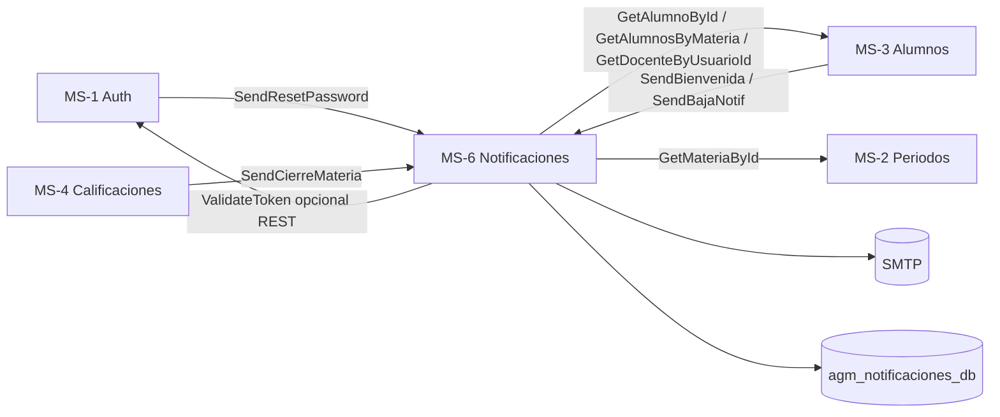

# Plan de acción — MS-6 Notificaciones (Epic 8)

**Desarrollador:** Makinohara  
**Microservicio:** MS-6 — Notificaciones  
**Carpeta:** `/ms-notificaciones/`  
**REST:** `8006` · **gRPC:** `50056` · **BD:** MySQL `agm_notificaciones_db`  
**Gateway:** `http://localhost:8080/notificaciones/*`  
**Backlog:** `docs/backlog_AGM_completo.md` — **ISSUE-801 … ISSUE-806**  
**Enunciado:** `docs/Proyecto_Final_SW_AGM.md` — §5.2 (correo), §5.3 **Módulo 7**, §5.4.1 MS-6  
**Contexto:** `docs/CONTEXTO_GLOBAL_PROYECTO.md` — §4 (tabla MS), §5 (mapa gRPC)  
**Especificación:** `docs/microservicios/MS6_NOTIFICACIONES.md`  
**Contrato:** `proto/notificaciones.proto`  
**Infra base (Epic 1):** Dockerfile, entrypoint, `.env.example`, `/health/`, CORS por env — **ya aplicado al esqueleto**

---

## 0. Lectura rápida (30 segundos)

| Pregunta | Respuesta |
|----------|-----------|
| ¿Qué hace MS-6? | Envía **correos transaccionales** por SMTP y audita en `HistorialCorreo`. |
| ¿Qué **no** hace? | No crea usuarios, no importa alumnos, no cierra materias. |
| ¿Cómo entran los datos? | gRPC desde MS-1, MS-3, MS-4 (+ REST para pruebas/Postman). |
| ¿Patrón a copiar? | **MS-2 Periodos** (`utils/`, `grpc_clients/`, `grpc_server/`) + capa **services** tipo **MS-1**. |
| ¿Orden de trabajo? | Fases **A → B → C → D → E → F → G** (abajo). No saltar a correos sin clientes gRPC. |

---

## 1. Rol del MS-6 en AGM

MS-6 es el **único** responsable del envío de **correos transaccionales**. No calcula calificaciones ni guarda alumnos: **solo** compone mensajes, envía por SMTP y registra auditoría.

| Flujo de negocio | Quién dispara | Cómo debe llamar a MS-6 |
|------------------|---------------|-------------------------|
| Clave de acceso al importar alumno | **MS-3** (post-import) | gRPC `SendBienvenida` (recomendado) |
| Baja de materia → aviso al docente | **MS-3** (post-baja) | gRPC `SendBajaNotif` |
| Cierre de materia → aviso a alumnos | **MS-4** (post-cerrar) | gRPC `SendCierreMateria` |
| Recuperación de contraseña | **MS-1** (forgot-password) | gRPC `SendResetPassword` |

**Regla de arquitectura (innegociable):** MS-6 **nunca** consulta la base de datos de otro microservicio. Solo `agm_notificaciones_db` + llamadas gRPC a MS-1, MS-2 y MS-3.



---

## 2. Resultados medibles (“terminado”)

| # | Resultado | Evidencia |
|---|-----------|-----------|
| M1 | Proyecto Django alineado al monorepo | `manage.py check`, migraciones, Docker `8006` healthy |
| M2 | Modelo `HistorialCorreo` + auditoría 100 % | Cada intento de envío deja fila (`exitoso` / `error_msg`) |
| M3 | SMTP operativo desde env | Management command `send_test_email` + 1 correo real en bandeja |
| M4 | **4** RPC gRPC implementados | `grpcurl` o script Python contra `:50056` |
| M5 | **4** flujos REST (Postman) | Misma lógica que gRPC (capa única `EmailService`) |
| M6 | Integración real con MS-3 y MS-1 | Import alumno → bienvenida; forgot-password → reset |
| M7 | Integración con MS-4 | Cierre materia → N correos + resumen sin timeout gateway |
| M8 | Sin secretos en Git | SMTP solo en `.env` / Railway |
| M9 | Demo §6.3 enunciado | Video/manual: **al menos un correo real** visible |

---

## 3. Estado actual del repo

| Área | Estado | Notas |
|------|--------|-------|
| Docker / Compose / health / CORS | ✅ | Epic 1 |
| App `apps/notificaciones` + `HistorialCorreo` | ✅ | Fase A |
| `utils/responses.py` | ✅ | Fase A |
| `services/` (`EmailService`, `HistorialService`, `TemplateService`) | ✅ | Fase B |
| Plantillas `templates/emails/` (4 tipos) | ✅ | Fase B |
| Tests unitarios (`locmem` outbox) | ✅ | Fase B — 5 tests |
| `grpc_clients/` reales (MS-1, MS-2, MS-3) | ✅ | Fase C |
| `GrpcDataProvider` + excepciones dominio | ✅ | Fase C |
| `grpc_server/` + REST vistas | ❌ | Fases D–E |
| Consumidores MS-3 | 🟡 | `notificaciones_client.py` con placeholders — Fase F |

---

## 4. Arquitectura objetivo (copiar de los mejores MS)

Estructura recomendada (paridad con **ms-periodos** + **ms-auth**):

```
ms-notificaciones/
├── apps/
│   └── notificaciones/              # App Django del dominio
│       ├── models.py                # HistorialCorreo
│       ├── views.py                 # REST finos → delegan a services
│       ├── urls.py                  # rutas bajo prefijo notificaciones
│       ├── services/
│       │   ├── email_service.py     # Orquestación: datos + SMTP + historial
│       │   └── template_service.py  # Render HTML (Django templates)
│       ├── templates/emails/        # bienvenida.html, baja.html, ...
│       └── migrations/
├── grpc_clients/
│   ├── auth_client.py               # ValidateToken (REST protegido)
│   ├── alumnos_client.py            # GetAlumnoById, GetAlumnosByMateria, GetDocenteByUsuarioId
│   └── periodos_client.py           # GetMateriaById
├── grpc_server/
│   ├── server.py                    # add_insecure_port 50056
│   └── servicer.py                  # NotificacionesServicer → EmailService
├── utils/
│   ├── responses.py                 # success_response / error_response (MS-2)
│   └── internal_auth.py             # X-Internal-Api-Key (MS-1 services)
├── proto_generated/
├── config/
├── generate_proto.sh
├── entrypoint.sh                    # migrate + gRPC en background + gunicorn
└── requirements.txt
```

**Principio DRY:** `EmailService.send_bienvenida(...)` es llamado desde **vista REST** y desde **`NotificacionesServicer.SendBienvenida`**. Cero duplicación de lógica SMTP.

---

## 5. Contratos oficiales

### 5.1 gRPC (`notificaciones.proto`) — paridad 1:1

| RPC | Request | Response | Caller principal |
|-----|---------|----------|------------------|
| `SendBienvenida` | `alumno_id`, `materia_id`, `clave_acceso` | `SendResponse` | MS-3 |
| `SendBajaNotif` | `alumno_id`, `docente_id` (**usuario_id**), `materia_id` | `SendResponse` | MS-3 |
| `SendCierreMateria` | `materia_id` | `SendResponse` | MS-4 |
| `SendResetPassword` | `email`, `token`, `reset_url` | `SendResponse` | MS-1 |

**`SendResponse`:** `success=false` si SMTP falló o faltan datos; `message` legible, **sin** stack trace en producción.

**Códigos gRPC recomendados:**

| Situación | Código |
|-----------|--------|
| IDs inválidos / alumno no existe | `NOT_FOUND` |
| Email/docente sin resolver | `FAILED_PRECONDITION` |
| SMTP / error interno | `INTERNAL` |
| Payload incompleto | `INVALID_ARGUMENT` |

> **Backlog ISSUE-806** menciona 3 métodos; el proto y el enunciado exigen **4** (incluye `SendResetPassword`). Implementar los **4**.

### 5.2 REST (gateway + Postman)

Prefijo Nginx: `/notificaciones/*` → puerto **8006** (sin `/api/` intermedio).

| Método | Ruta | Body JSON | Issue |
|--------|------|-----------|-------|
| POST | `/notificaciones/bienvenida` | `alumno_id`, `materia_id`, `clave_acceso` | 802 |
| POST | `/notificaciones/baja` | `alumno_id`, `docente_id`, `materia_id` | 803 |
| POST | `/notificaciones/cierre-materia` | `materia_id` | 804 |
| POST | `/notificaciones/reset-password` | `email`, `token`, `reset_url` | 805 |

**Envelope JSON obligatorio** (patrón **MS-2** `utils/responses.py`):

```json
{ "success": true, "data": { "enviados": 1, "fallidos": 0 }, "message": "OK" }
```

Errores: `success: false`, `data: null`, `errors: {}` cuando aplique validación.

**Alineación backlog ↔ spec:**

| Tema | Backlog | Decisión del plan |
|------|---------|-------------------|
| Bienvenida sin `clave` en REST | ISSUE-802 solo `alumno_id`, `materia_id` | REST **incluye** `clave_acceso` (como `MS6_NOTIFICACIONES.md` y el proto). La clave la genera **MS-1** en import; MS-3 la pasa en gRPC. |
| Baja sin `materia_id` | ISSUE-803 | Body **con** `materia_id` (proto + asunto del correo). |
| Cierre asíncrono | threading o Celery | **Fase D:** `ThreadPoolExecutor` con `max_workers` desde env (MVP). Celery solo si el equipo ya lo tiene en Epic 1. |

### 5.3 Modelo `HistorialCorreo` (ISSUE-801)

| Campo | Tipo | Notas |
|-------|------|-------|
| `tipo` | CharField choices | `bienvenida`, `baja`, `cierre_materia`, `reset_password` |
| `destinatario_email` | EmailField | |
| `asunto` | CharField(255) | |
| `cuerpo` | TextField | HTML guardado para auditoría (opcional truncar si es enorme) |
| `enviado_en` | DateTimeField | `auto_now_add` |
| `exitoso` | BooleanField | |
| `error_msg` | TextField, null | Mensaje SMTP o upstream |

Índice recomendado: `(tipo, enviado_en)` para consultas en demo/admin.

---

## 6. Clientes gRPC salientes (MS-6 → otros)

Patrón **ms-periodos/grpc_clients/auth_client.py**: stub singleton, `timeout=5`, hosts desde `decouple`.

| Destino | Métodos | Uso |
|---------|---------|-----|
| **MS-3** | `GetAlumnoById`, `GetAlumnosByMateria`, `GetDocenteByUsuarioId` | Destinatarios y textos |
| **MS-2** | `GetMateriaById` | NRC, nombre, periodo en plantillas |
| **MS-1** | `ValidateToken` | Solo si algún REST lo expone a usuario humano (opcional) |

Variables (ya en `.env.example`; **no** hardcodear `agm-ms-notificaciones`):

```env
MS_AUTH_GRPC_HOST=ms-auth
MS_AUTH_GRPC_PORT=50051
MS_ALUMNOS_GRPC_HOST=ms-alumnos
MS_ALUMNOS_GRPC_PORT=50053
MS_PERIODOS_GRPC_HOST=ms-periodos
MS_PERIODOS_GRPC_PORT=50052
```

**Política de errores upstream:** si MS-3 devuelve `NOT_FOUND`, MS-6 no envía correo y responde fallo claro al caller (no inventar email).

---

## 7. Seguridad y quién puede llamar

| Endpoint / RPC | ¿Quién? | Mecanismo |
|----------------|---------|-----------|
| gRPC `Send*` | MS-1, MS-3, MS-4 | Red Docker interna; opcional metadata `x-internal-key` en v2 |
| REST `POST /notificaciones/*` | Otros MS o admin en pruebas | Header `X-Internal-Api-Key` (mismo patrón que `ms-auth` `INTERNAL_API_KEY`) |
| REST desde Postman (dev) | Desarrollador | API key en env local **o** JWT admin vía `ValidateToken` |

| Tema | Acción |
|------|--------|
| HTML | Templates Django con **autoescape**; no interpolar HTML crudo de usuarios |
| Logs | **Nunca** loguear `clave_acceso`, `token` completo ni `EMAIL_HOST_PASSWORD` |
| Reset | Solo enlace en correo; **nunca** la contraseña nueva |
| Rate limit | Opcional MVP en `reset-password`; documentar riesgo de abuso |

---

## 8. Variables de entorno (completas)

```env
# Django / BD (Epic 1)
SECRET_KEY=...
DEBUG=True
ALLOWED_HOSTS=*
SERVICE_NAME=ms-notificaciones
DB_HOST=db-notificaciones
DB_PORT=3306
DB_NAME=agm_notificaciones_db
DB_USER=root
DB_PASSWORD=...
DB_CHARSET=utf8mb4
REST_PORT=8006
GRPC_PORT=50056

# CORS
CORS_ALLOW_ALL_ORIGINS=True
CORS_ALLOWED_ORIGINS=http://localhost:4200,http://127.0.0.1:8080

# gRPC clients
MS_AUTH_GRPC_HOST=ms-auth
MS_AUTH_GRPC_PORT=50051
MS_ALUMNOS_GRPC_HOST=ms-alumnos
MS_ALUMNOS_GRPC_PORT=50053
MS_PERIODOS_GRPC_HOST=ms-periodos
MS_PERIODOS_GRPC_PORT=50052

# SMTP
EMAIL_HOST=smtp.gmail.com
EMAIL_PORT=587
EMAIL_USE_TLS=True
EMAIL_HOST_USER=...
EMAIL_HOST_PASSWORD=...
DEFAULT_FROM_EMAIL=AGM Sistema <noreply@buap.mx>

# Enlaces
FRONTEND_URL=http://localhost:4200

# Seguridad servicio-a-servicio (REST)
INTERNAL_API_KEY=cambiar-en-produccion

# Envío masivo (ISSUE-804)
EMAIL_MAX_WORKERS=5
EMAIL_BATCH_TIMEOUT_SEC=120
```

Comando de prueba (Fase A): `python manage.py send_test_email --to tu@correo.com`

---

## 9. Fases de ejecución (orden estricto)

### Fase 0 — Pre-requisitos y acuerdos de equipo

**Objetivo:** Evitar retrabajo con MS-1, MS-3 y MS-4.

| # | Tarea | Responsable | Criterio |
|---|--------|-------------|----------|
| 0.1 | Confirmar que MS-3 expone `GetDocenteByUsuarioId` y lista solo inscritos **activos** en `GetAlumnosByMateria` | Alane / MS-3 | Prueba gRPC desde MS-6 o `grpcurl` |
| 0.2 | MS-1: `forgot-password` llama `SendResetPassword` con `reset_url = FRONTEND_URL + '/reset-password?token=' + token` | Gerardo | E2E con MS-6 en Compose |
| 0.3 | MS-4: tras cerrar materia llama `SendCierreMateria` (ver `Deuda_Tecnica.md` ISSUE-608) | Guillermo | No cerrar sin notificar o documentar fallback |
| 0.4 | MS-3: reemplazar host `agm-ms-notificaciones` por env `MS_NOTIFICACIONES_GRPC_*` | Makinohara + Alane | Sin strings fijos en `notificaciones_client.py` |
| 0.5 | `docker compose up` con los 7 MS healthy | Infra | Gateway `:8080` responde |

**Salida Fase 0:** tabla de acuerdos firmada en PR o comentario en issue Epic 8.

---

### Fase A — ✅ Completada (ISSUE-801)

**Entregables en repo:** `apps/notificaciones/`, `HistorialCorreo`, migración `0001_initial`, `utils/responses.py`, SMTP en `settings.py`, `send_test_email`, URLs bajo `notificaciones/`, admin, `entrypoint.sh` + puerto **8006**.

#### Checklist

- [x] App `apps.notificaciones` en `INSTALLED_APPS`
- [x] Modelo `HistorialCorreo` + índice `(tipo, enviado_en)`
- [x] `utils/responses.py` (envelope `success`, `data`, `message`, `errors`)
- [x] `config/urls.py` incluye `notificaciones/`
- [x] Variables SMTP vía `python-decouple`
- [x] Comando `send_test_email --to`
- [x] Docker: migrate + Gunicorn en `:8006` + healthcheck

#### Cómo comprobar (Fase A)

```powershell
# 1. Reconstruir y levantar MS-6
docker compose up --build -d ms-notificaciones

# 2. Django sin errores
docker exec agm-ms-notificaciones python manage.py check

# 3. Migración aplicada
docker exec agm-ms-notificaciones python manage.py showmigrations notificaciones
# Debe mostrar [X] 0001_initial

# 4. Health
curl http://localhost:8006/health/

# 5. SMTP real (requiere EMAIL_HOST_USER y EMAIL_HOST_PASSWORD en ms-notificaciones/.env)
docker exec agm-ms-notificaciones python manage.py send_test_email --to tu-correo@gmail.com

# 6. Admin (opcional): http://localhost:8006/admin/ — tabla historial_correo vacía o con pruebas
```

**Criterio ISSUE-801:** contenedor healthy + `check` OK + (opcional) correo de prueba recibido.

---

### Fase B — ✅ Completada (capa de dominio)

**Entregables en repo:**

| Archivo | Rol |
|---------|-----|
| `services/email_service.py` | 4 métodos de envío + manejo de excepciones |
| `services/historial_service.py` | Auditoría en BD |
| `services/template_service.py` | Render HTML |
| `services/data_provider.py` | `PlaceholderDataProvider` + `GrpcDataProvider` |
| `templates/emails/*.html` | bienvenida, baja, cierre_materia, reset_password + `base.html` |
| `tests/test_email_service.py` | 5 tests con `locmem` |

#### Checklist

- [x] `EmailService.send_bienvenida(alumno_id, materia_id, clave_acceso)`
- [x] `EmailService.send_baja(alumno_id, docente_id, materia_id)`
- [x] `EmailService.send_cierre_materia(materia_id)` → `{enviados, fallidos, detalle}`
- [x] `EmailService.send_reset_password(email, token, reset_url)`
- [x] `HistorialService.registrar(...)` en cada intento (éxito o fallo)
- [x] Plantillas responsive (BUAP / AGM)
- [x] Tests unitarios sin SMTP real

#### Cómo comprobar (Fase B)

```powershell
# Tests (usa BD de prueba temporal dentro del contenedor)
docker exec agm-ms-notificaciones python manage.py test apps.notificaciones.tests.test_email_service -v 2
# Esperado: Ran 5 tests ... OK

# Probar servicio manualmente en shell Django (opcional)
docker exec -it agm-ms-notificaciones python manage.py shell
```

```python
from apps.notificaciones.services import EmailService
svc = EmailService()
r = svc.send_bienvenida(1, 10, "ClaveDemo123")
print(r)  # success True si locmem/SMTP configurado
from apps.notificaciones.models import HistorialCorreo
HistorialCorreo.objects.count()  # >= 1
```

```powershell
# Ver historial en MySQL (host 13312)
# SELECT id, tipo, destinatario_email, exitoso FROM historial_correo ORDER BY id DESC LIMIT 5;
```

---

### Fase C — ✅ Completada (clientes gRPC salientes)

**Entregables:** `grpc_clients/` (auth, alumnos, periodos), `GrpcDataProvider`, excepciones en `exceptions.py`, `EmailService` usa gRPC por defecto (`USE_PLACEHOLDER_DATA=False`).

| Archivo | Rol |
|---------|-----|
| `grpc_clients/channel.py` | Canal singleton + timeout 5 s |
| `grpc_clients/errors.py` | `NOT_FOUND` → `AlumnoNotFound` / `MateriaNotFound` / … |
| `grpc_clients/alumnos_client.py` | MS-3 |
| `grpc_clients/periodos_client.py` | MS-2 |
| `grpc_clients/auth_client.py` | MS-1 `ValidateToken` |
| `services/data_provider.py` | `GrpcDataProvider` |

#### Checklist

- [x] Singleton de canales por servicio (`ms-auth`, `ms-alumnos`, `ms-periodos`)
- [x] Timeout 5 s (`GRPC_CLIENT_TIMEOUT`)
- [x] Hosts/puertos desde `MS_*_GRPC_HOST` / `PORT`
- [x] `GrpcDataProvider` integrado en `EmailService` (default)
- [x] Excepciones de dominio capturadas → `_fail` + historial
- [x] `generate_proto.sh` incluye auth, alumnos, periodos, notificaciones
- [x] Tests `test_grpc_clients.py`

#### Cómo comprobar (Fase C)

```powershell
# Rebuild MS-6 (USE_PLACEHOLDER_DATA=False en .env)
docker compose up --build -d ms-notificaciones ms-alumnos ms-periodos ms-auth

# Tests unitarios (mocks + mapeo de errores)
docker exec agm-ms-notificaciones python manage.py test apps.notificaciones.tests -v 2

# Shell: llamada real a MS-3 (requiere alumno id existente en BD)
docker exec -it agm-ms-notificaciones python manage.py shell
```

```python
from grpc_clients.alumnos_client import get_alumno_by_id
from apps.notificaciones.services.data_provider import GrpcDataProvider
# get_alumno_by_id(1)  # id real en tu BD
GrpcDataProvider().get_alumno(1)
```

```powershell
# EmailService con gRPC (sin placeholder)
docker exec agm-ms-notificaciones python -c "
import django; django.setup()
from apps.notificaciones.services import EmailService
from apps.notificaciones.services.data_provider import GrpcDataProvider
svc = EmailService(data_provider=GrpcDataProvider())
print(svc.send_bienvenida(1, 1, 'clave-test'))
"
```

**Tests locales con placeholder:** `USE_PLACEHOLDER_DATA=True` en `.env` o inyectar `PlaceholderDataProvider()` en tests.

---

### Fase D — REST (ISSUE-802 … 805)

**Objetivo:** API HTTP para Postman y fallback; delegación total a `EmailService`.

| # | Tarea | Criterio |
|---|--------|----------|
| D.1 | `utils/internal_auth.py` — decorador `@internal_or_admin` | 401 sin key/JWT |
| D.2 | Vista `BienvenidaView` POST | 400 campos faltantes; 200 con `data` resumen |
| D.3 | Vista `BajaView` POST | |
| D.4 | Vista `CierreMateriaView` POST | Thread pool; respuesta en &lt; 30 s con 20 alumnos |
| D.5 | Vista `ResetPasswordView` POST | MS-1 puede usar REST si no tiene aún cliente gRPC |
| D.6 | Registrar URLs en `apps/notificaciones/urls.py` | Gateway `POST :8080/notificaciones/bienvenida` OK |

**ISSUE-804 — envío masivo:**

```
1. GetAlumnosByMateria(materia_id)
2. Para cada alumno (pool max EMAIL_MAX_WORKERS):
     - send individual SMTP
     - registrar HistorialCorreo
3. Responder { enviados, fallidos, errores_opcional }
```

**Criterio de salida Fase D:** carpeta Postman “MS-6” con 4 requests verdes detrás del gateway.

---

### Fase E — Servidor gRPC (ISSUE-806)

**Objetivo:** Patrón **ms-periodos/grpc_server/** (`server.py` + `servicer.py`).

| # | Tarea | Criterio |
|---|--------|----------|
| E.1 | `NotificacionesServicer` implementa 4 RPC | Sin `NotImplementedError` |
| E.2 | Cada RPC llama a `EmailService` | Misma respuesta que REST |
| E.3 | `entrypoint.sh` lanza `python -m grpc_server.server &` antes de Gunicorn | Puerto **50056** escuchando |
| E.4 | Pruebas `grpcurl -plaintext localhost:50056 list` | |
| E.5 | Documentar en manual técnico captura de prueba gRPC | |

**Criterio de salida Fase E:** ISSUE-806 ✅ (4 métodos, no 3).

---

### Fase F — Integración E2E con consumidores

**Objetivo:** Cerrar deuda con MS-1, MS-3, MS-4.

| # | Escenario | Pasos | Esperado |
|---|-----------|-------|----------|
| F.1 | Bienvenida | MS-3 importa alumno con clave real de MS-1 | Correo recibido; historial `bienvenida` |
| F.2 | Baja | Alumno solicita baja en MS-3 | Docente recibe correo |
| F.3 | Cierre | MS-4 `POST .../cerrar` | N historiales `cierre_materia` |
| F.4 | Reset | `POST /auth/forgot-password` MS-1 | Correo con enlace válido en `:4200` |
| F.5 | MS-6 caído | MS-3 importa alumno | Import **no** debe fallar (solo log warning — ya patrón en `notificaciones_client.py`) |

**Tareas código en otros MS (coordinación):**

| MS | Archivo | Cambio |
|----|---------|--------|
| MS-3 | `utils/notificaciones_client.py` | Host/puerto desde env; `clave_acceso` y `docente_id` reales |
| MS-1 | flujo forgot-password | Cliente gRPC `SendResetPassword` |
| MS-4 | cierre materia | Cliente gRPC `SendCierreMateria` |

**Criterio de salida Fase F:** checklist F.1–F.4 ejecutado en local con correo real.

---

### Fase G — Calidad, documentación y entrega

| # | Tarea | Criterio |
|---|--------|----------|
| G.1 | Ampliar `docs/postman_collection.json` con carpeta MS-6 | 4 endpoints |
| G.2 | README raíz: puerto 8006, variables SMTP, gRPC 50056 | |
| G.3 | Actualizar `Deuda_Tecnica.md` / backlog checks | Issues 801–806 marcados |
| G.4 | Matriz de pruebas (sección 10) ejecutada | Evidencia en PR |
| G.5 | Video demo: mostrar historial en admin + bandeja de entrada | §6.3 enunciado |

---

## 10. Matriz de pruebas (obligatoria)

| ID | Caso | Entrada | Resultado esperado |
|----|------|---------|---------------------|
| P1 | Bienvenida gRPC | IDs válidos + clave | `success=true`, correo, historial `exitoso` |
| P2 | Bienvenida | `alumno_id` inexistente | gRPC `NOT_FOUND` / HTTP 404 |
| P3 | Baja | IDs válidos | Docente recibe correo |
| P4 | Cierre | 0 alumnos | `success=true`, `enviados=0`, mensaje claro |
| P5 | Cierre | ≥20 alumnos | Sin timeout gateway; 20 filas historial |
| P6 | Reset | email válido | Enlace abre frontend |
| P7 | SMTP caído | credencial inválida | `exitoso=false`, servicio **no** crashea |
| P8 | REST sin API key | POST bienvenida | 401 |
| P9 | Preflight CORS | OPTIONS desde `:4200` | 200 (con Epic 1 CORS) |
| P10 | Health | `GET :8006/health/` | `{"status":"ok"}` |

---

## 11. Trazabilidad backlog ↔ fases

| Issue | Fase | Entregable principal |
|-------|------|----------------------|
| 801 | A | Proyecto + modelo + SMTP prueba |
| 802 | B + D + E | Bienvenida REST + gRPC |
| 803 | B + D + E | Baja REST + gRPC |
| 804 | B + D + E | Cierre + threading |
| 805 | B + D + E | Reset REST + gRPC |
| 806 | E | Servidor 50056, 4 RPC |

---

## 12. Riesgos y mitigaciones

| Riesgo | Mitigación |
|--------|------------|
| Gmail bloquea envíos | App Password; alternativa SendGrid/SES documentada en Railway |
| Proto/código desalineado | `generate_proto.sh` en PR; CI Epic 1 build |
| Timeout cierre masivo | Pool acotado + respuesta con resumen; no bloquear MS-4 |
| MS-3/MS-4 no llaman MS-6 | Fase 0 acuerdos + Fase F E2E |
| Duplicar correos en reintentos | Caller idempotente; opcional: no reenviar si historial exitoso &lt; 5 min (v2) |
| Host hardcodeado en MS-3 | Fase 0.4 |

---

## 13. Checklist final Epic 8

- [x] Fase A (ISSUE-801) — fundación Django + SMTP.
- [x] Fase B — `EmailService` + plantillas + tests unitarios.
- [x] Fase C — clientes gRPC + `GrpcDataProvider`.
- [x] Fases D → G (REST, gRPC server, E2E, docs).
- [x] ISSUE-801 … **806** (4 RPC) en código y backlog.
- [x] `proto/notificaciones.proto` = implementación 1:1.
- [x] Postman MS-6 (local + gateway `:8080`).
- [x] Integración MS-1, MS-3, MS-4 verificada (Fase F).
- [ ] **Un correo real** en demo (criterio §6.3) — ver `EVIDENCIA_DEMO_MS6.md`.
- [x] Sin secretos SMTP en Git; producción con `CORS_ALLOW_ALL_ORIGINS=False` documentado.
- [x] README MS-6 + matriz P1–P10 (`MATRIZ_PRUEBAS_MS6.md`).

---

## 14. Referencias

| Documento | Uso |
|-----------|-----|
| `docs/backlog_AGM_completo.md` | Epic 8, issues 801–806 |
| `docs/Proyecto_Final_SW_AGM.md` | Módulo 7 |
| `docs/CONTEXTO_GLOBAL_PROYECTO.md` | Mapa gRPC §5 |
| `docs/microservicios/MS6_NOTIFICACIONES.md` | Spec detallada |
| `proto/notificaciones.proto` | Contrato |
| `ms-periodos/` | Referencia `utils/`, `grpc_server/`, `grpc_clients/` |
| `ms-auth/apps/core/services.py` | Patrón capa servicios + API key |
| `ms-alumnos/utils/notificaciones_client.py` | Consumidor a corregir |
| `docs/devs/Makinohara/PLAN_ACCION_EPIC1_INFRAESTRUCTURA_DEVOPS.md` | Docker, CORS, gateway |
| `Deuda_Tecnica.md` | ISSUE-608, placeholders MS-3 → MS-6 |
