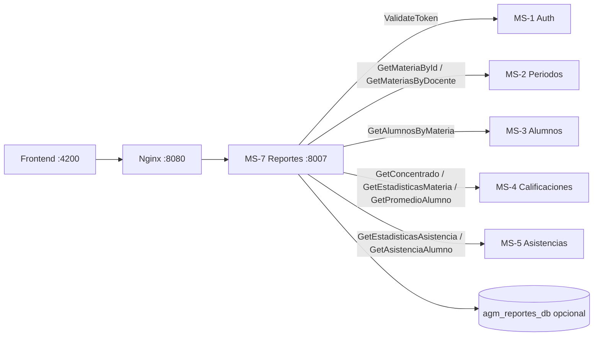

# Plan de acción — MS-7 Reportes y Estadísticas (Epic 9)

**Desarrollador:** Makinohara  
**Microservicio:** MS-7 — Reportes & Estadísticas  
**Carpeta:** `/ms-reportes/`  
**REST:** `8007` · **gRPC:** `50057` · **BD:** MySQL `agm_reportes_db`  
**Gateway:** `http://localhost:8080/reportes/*` y `http://localhost:8080/estadisticas/*`  
**Backlog:** `docs/backlog_AGM_completo.md` — **ISSUE-901 … ISSUE-907**  
**Enunciado:** `docs/Proyecto_Final_SW_AGM.md` — §5.2.2 (exportación Excel/PDF), §5.2.3 (estadísticas), §5.3 **Módulos 8 y 9**, §5.4.1 MS-7  
**Contexto:** `docs/CONTEXTO_GLOBAL_PROYECTO.md` — §4 (tabla MS), §5 (mapa gRPC)  
**Especificación:** `docs/microservicios/MS7_REPORTES_ESTADISTICAS.md`  
**Contrato:** `proto/reportes.proto`  
**Infra base (Epic 1):** Dockerfile, entrypoint, `.env.example`, `/health/`, CORS por env — **ya aplicado al esqueleto**

---

## 0. Lectura rápida (30 segundos)

| Pregunta | Respuesta |
|----------|-----------|
| ¿Qué hace MS-7? | **Genera** Excel/PDF y **JSON** de estadísticas; no guarda calificaciones ni asistencias. |
| ¿Qué **no** hace? | No edita notas, no toma asistencia, no es fuente de verdad académica. |
| ¿Cómo obtiene datos? | **Solo gRPC** a MS-1…MS-5 (+ su BD opcional para caché/metadatos). |
| ¿Patrón a copiar? | **MS-6** (fases + `grpc_clients/` + `grpc_server/`) + generadores tipo **reporting service** + auth **MS-2/MS-4**. |
| ¿Orden de trabajo? | Fases **0 → A → B → C → D → E → F → G**. No publicar REST sin clientes gRPC probados. |

---

## 1. Rol del MS-7 en AGM

MS-7 es el **agregador y exportador**: transforma datos que ya existen en otros MS en **archivos descargables** y **dashboards JSON**.

| Capacidad | Salida | Consumidor típico |
|-----------|--------|-------------------|
| Reporte concentrado calificaciones | `.xlsx` / `.pdf` | Docente, admin (actas) |
| Reporte concentrado asistencias | `.xlsx` / `.pdf` | Docente, admin |
| Historial estadístico docente | JSON envelope | Frontend módulo docente |
| Estadísticas alumno | JSON envelope | Frontend módulo alumno |
| `GenerateReport` / `GetHistorialDocente` | bytes / proto | Integraciones internas |

**Regla de arquitectura (innegociable):** MS-7 **nunca** conecta a `agm_calificaciones_db`, `agm_alumnos_db`, etc. Solo `agm_reportes_db` (metadatos/caché opcional) + gRPC saliente.



---

## 2. Resultados medibles (“terminado”)

| # | Resultado | Evidencia |
|---|-----------|-----------|
| M1 | Proyecto Django alineado al monorepo | `manage.py check`, migraciones, Docker `8007` healthy |
| M2 | Clientes gRPC a MS-1…5 operativos | Tests con mocks + 1 llamada real por upstream |
| M3 | Capa única `ReportDataService` (agregación) | Misma fuente para Excel, PDF, JSON y gRPC |
| M4 | **2** tipos de reporte × **2** formatos (calif/asist × xlsx/pdf) | Descarga vía gateway con `Content-Disposition` |
| M5 | **2** endpoints estadísticas JSON | Envelope AGM; RBAC docente/alumno |
| M6 | Servidor gRPC **50057** (2 RPC) | `grpcurl` o script Python |
| M7 | Postman carpeta MS-7 | 6+ requests (reportes + stats + health) |
| M8 | Matriz R1–R10 ejecutada | `MATRIZ_PRUEBAS_MS7.md` (Fase G) |
| M9 | Demo §6.3 enunciado | Video: export Excel/PDF en flujo docente |

---

## 3. Estado actual del repo

| Área | Estado | Notas |
|------|--------|-------|
| Docker / Compose / health / CORS | ✅ | Epic 1 |
| `proto_generated/` (reportes, auth, periodos, alumnos, calificaciones, asistencias) | ✅ | Stubs en imagen |
| `generate_proto.sh` | ✅ | Revisar paridad con `proto/` raíz |
| App de dominio `apps/reportes/` | ❌ | Solo `config/` + health |
| `grpc_clients/` | ❌ | Fase B |
| `services/` (agregación + generadores) | ❌ | Fases C–D |
| REST reportes / estadísticas | ❌ | Fases D–E |
| `grpc_server/` | ❌ | Fase F |
| Tests automatizados | ❌ | Fase G |
| Postman MS-7 | ❌ | Fase G |

---

## 4. Arquitectura objetivo (copiar lo mejor de MS-6 + MS-4)

Estructura recomendada:

```
ms-reportes/
├── apps/
│   └── reportes/
│       ├── models.py                 # ReporteGenerado (opcional, Fase A)
│       ├── views/
│       │   ├── reportes_views.py     # GET binarios → FileResponse
│       │   └── estadisticas_views.py # GET JSON → envelope
│       ├── urls.py                   # reportes/ + estadisticas/
│       ├── serializers.py            # Validación query params (formato, ids)
│       ├── permissions.py            # Docente titular / alumno self / admin
│       ├── services/
│       │   ├── report_data_service.py    # Orquesta gRPC → DTOs unificados
│       │   ├── calificaciones_report.py  # build rows calificaciones
│       │   ├── asistencias_report.py     # build rows asistencias
│       │   ├── estadisticas_service.py   # historial docente / stats alumno
│       │   ├── excel_generator.py        # openpyxl
│       │   └── pdf_generator.py          # reportlab
│       ├── dto/                      # dataclasses: ReporteCalificacionesDTO, …
│       └── tests/
├── grpc_clients/
│   ├── channel.py
│   ├── auth_client.py
│   ├── periodos_client.py
│   ├── alumnos_client.py
│   ├── calificaciones_client.py
│   └── asistencias_client.py
├── grpc_server/
│   ├── server.py
│   └── servicer.py                   # ReportesServicer → services
├── utils/
│   ├── responses.py                  # success_response / error_response (JSON)
│   └── auth.py                       # JWT vía MS-1 ValidateToken
├── proto_generated/
├── config/
├── generate_proto.sh
├── entrypoint.sh                     # migrate + gRPC background + gunicorn
└── requirements.txt                  # openpyxl, reportlab, grpcio, DRF
```

**Principio DRY:** `ReportDataService.get_concentrado_calificaciones(materia_id)` alimenta:

- `GET /reportes/calificaciones/:id?formato=xlsx|pdf`
- `ReportesServicer.GenerateReport(tipo=calificaciones, …)`

---

## 5. Contratos oficiales

### 5.1 gRPC (`reportes.proto`) — paridad 1:1

| RPC | Request | Response | Equivalente REST |
|-----|---------|----------|------------------|
| `GenerateReport` | `tipo` (`calificaciones` \| `asistencias`), `materia_id`, `formato` (`pdf` \| `xlsx`) | `success`, `archivo` (bytes), `filename`, `content_type` | `GET /reportes/{tipo}/:materiaId` |
| `GetHistorialDocente` | `docente_id` | `HistorialDocenteResponse` + `repeated StatsPeriodo` | `GET /estadisticas/docente/:id` |

**`StatsPeriodo` (rellenar todos los campos del proto):**

`periodo_nombre`, `periodo_id`, `materia_nombre`, `materia_id`, `total_alumnos`, `aprobados`, `reprobados`, `promedio_grupal`, `porcentaje_asistencia`.

**Códigos gRPC recomendados:**

| Situación | Código |
|-----------|--------|
| Materia / concentrado no existe | `NOT_FOUND` |
| Usuario no es docente de la materia | `PERMISSION_DENIED` |
| Formato o tipo inválido | `INVALID_ARGUMENT` |
| Timeout upstream MS-4/MS-5 | `UNAVAILABLE` |
| Error generando PDF/Excel | `INTERNAL` |

### 5.2 REST — reportes (descarga binaria)

Prefijos gateway: `/reportes/*` → puerto **8007** (sin `/api/` intermedio).

| Método | Ruta | Query | Issue |
|--------|------|-------|-------|
| GET | `/reportes/calificaciones/<materiaId>` | `formato=xlsx` \| `xls` \| `pdf` | 902, 903 |
| GET | `/reportes/asistencias/<materiaId>` | `formato=xlsx` \| `xls` \| `pdf` | 904 |

**Respuesta HTTP (no envelope JSON):**

| Header | Valor |
|--------|--------|
| `Content-Type` | `application/vnd.openxmlformats-officedocument.spreadsheetml.sheet` o `application/pdf` |
| `Content-Disposition` | `attachment; filename="calificaciones_<NRC>.xlsx"` |

**Errores (sí envelope JSON):** 400 formato inválido; 401 sin JWT; 403 no titular; 404 sin datos; 503 upstream timeout.

### 5.3 REST — estadísticas (JSON envelope)

Patrón **MS-2** `utils/responses.py`:

```json
{ "success": true, "data": { "periodos": [ ... ] }, "message": "OK" }
```

| Método | Ruta | Issue |
|--------|------|-------|
| GET | `/estadisticas/docente/<id>` | 905 |
| GET | `/estadisticas/alumno/<id>` | 906 |

### 5.4 Convención de IDs (decisión del plan — documentar en README)

| Parámetro en URL | Significado | Fuente |
|------------------|-------------|--------|
| `docente_id` en `/estadisticas/docente/:id` y proto | **`usuario_id` de MS-1** (mismo que `Docente.usuario_id` en MS-3) | Alineado MS-2 `Materia.docente_id` |
| `alumno_id` en `/estadisticas/alumno/:id` | **PK `Alumno.id` en MS-3** | gRPC `GetPromedioAlumno` |
| `materiaId` en reportes | **PK materia en MS-2** | `GetMateriaById` |

> No mezclar `Docente.id` (tabla MS-3) con `usuario_id` sin documentar — causa 403 silenciosos.

### 5.5 Alineación backlog ↔ spec

| Tema | Backlog | Decisión del plan |
|------|---------|-------------------|
| `formato=xls` | ISSUE-902 | Aceptar **`xls` como alias de `xlsx`** (`openpyxl` solo genera xlsx moderno) |
| WeasyPrint vs reportlab | ISSUE-903 | **reportlab** (ya en spec MS7 y dependencias del repo) |
| Caché de reportes | ISSUE-901 opcional | Modelo `ReporteGenerado` solo si demos &gt; 5 s; MVP sin caché |
| Recalcular promedios | Tentación en MS-7 | **Prohibido** — usar `promedio_real` / `promedio_redondeado` de MS-4 tal cual |

---

## 6. Clientes gRPC salientes (MS-7 → otros)

Patrón **ms-notificaciones/grpc_clients/**: canal por servicio, timeout por env, sin hosts hardcodeados.

| Destino | Métodos | Uso en MS-7 |
|---------|---------|-------------|
| **MS-1** | `ValidateToken`, `CheckRole` | Cada REST autenticado |
| **MS-2** | `GetMateriaById`, `GetMateriasByDocente`, `GetPeriodoActivo` | Encabezados, RBAC titular, stats docente |
| **MS-3** | `GetAlumnosByMateria`, (futuro: inscripciones por alumno) | Nombres, matrículas, merge asistencias |
| **MS-4** | `GetConcentrado`, `GetEstadisticasMateria`, `GetPromedioAlumno` | Reportes calif + stats |
| **MS-5** | `GetEstadisticasAsistencia`, `GetAsistenciaAlumno` | Reportes asist + stats |

```env
MS_AUTH_GRPC_HOST=ms-auth
MS_AUTH_GRPC_PORT=50051
MS_PERIODOS_GRPC_HOST=ms-periodos
MS_PERIODOS_GRPC_PORT=50052
MS_ALUMNOS_GRPC_HOST=ms-alumnos
MS_ALUMNOS_GRPC_PORT=50053
MS_CALIFICACIONES_GRPC_HOST=ms-calificaciones
MS_CALIFICACIONES_GRPC_PORT=50054
MS_ASISTENCIAS_GRPC_HOST=ms-asistencias
MS_ASISTENCIAS_GRPC_PORT=50055
GRPC_CLIENT_TIMEOUT=10
GRPC_CLIENT_TIMEOUT_CALIFICACIONES=30
```

**Política N+1:** en estadísticas docente, iterar materias con límite razonable; si &gt; 20 materias, documentar paginación o cache (Fase E).

---

## 7. Reglas de negocio que no puede romper MS-7

| Regla | Fuente | Implementación |
|-------|--------|----------------|
| Promedio real y redondeado | Enunciado §5.2.2, MS-4 | Copiar de `AlumnoCalificacion` en `GetConcentrado` |
| Aprobado / reprobado | MS-4 `GetEstadisticasMateria` | No redefinir umbral 6.0 en MS-7 sin acuerdo |
| Solo titular o admin descarga reportes | RBAC | `materia.docente_id == token.user_id` o rol admin |
| Alumno solo ve su `alumno_id` | ISSUE-906 | 403 si token alumno y `id` ajeno |
| UTF-8 en nombres | Datos BUAP | Fuentes reportlab compatibles con acentos |
| Alumno de baja no en concentrado | MS-3 inscritos activos | Confiar en `GetAlumnosByMateria` + `GetConcentrado` |
| Reportes en tiempo real | Spec MS7 | Sin precálculo obligatorio; caché opcional |

---

## 8. Diseño de archivos generados

### 8.1 Excel calificaciones (ISSUE-902)

| Sección | Contenido |
|---------|-----------|
| Filas 1–4 | BUAP / FCC, materia, NRC, sección, periodo, docente (MS-2) |
| Cabecera | Matrícula, nombre, [columnas por actividad según `CategoriaConcentrado`], promedio real, promedio redondeado |
| Filas datos | Un alumno por fila; orden por matrícula |
| Formato | Auto-width columnas; congelar fila cabecera |

### 8.2 PDF calificaciones (ISSUE-903)

- Misma tabla que Excel (reportlab `Table`).  
- Pie: fecha generación + usuario (opcional).  
- Salto de página si muchas columnas/actividades.

### 8.3 Excel/PDF asistencias (ISSUE-904)

| Columna | Fuente |
|---------|--------|
| Matrícula, nombre | MS-3 |
| Total clases, presentes, retardos, ausentes, % | MS-5 |
| Alumnos inscritos sin registro | Fila con ausentes = total (regla acordada con MS-5) |

---

## 9. Autorización (matriz)

| Recurso | Admin | Docente | Alumno |
|---------|-------|---------|--------|
| Reporte calif. materia M | ✅ | ✅ si `M.docente_id == user_id` | ❌ |
| Reporte asist. materia M | ✅ | ✅ si titular | ❌ |
| `GET /estadisticas/docente/D` | ✅ | ✅ si `D == user_id` | ❌ |
| `GET /estadisticas/alumno/A` | ✅ (política equipo) | ❌ | ✅ si `A == su alumno_id` |

Implementación: decorador o permission class que llama `ValidateToken` y compara roles/ids.

---

## 10. Variables de entorno (completas)

```env
# Django / BD
SECRET_KEY=...
DEBUG=True
ALLOWED_HOSTS=*
SERVICE_NAME=ms-reportes
DB_HOST=db-reportes
DB_PORT=3306
DB_NAME=agm_reportes_db
DB_USER=root
DB_PASSWORD=...
REST_PORT=8007
GRPC_PORT=50057
GRPC_MAX_WORKERS=10

# CORS — desarrollo True; producción False + lista explícita
CORS_ALLOW_ALL_ORIGINS=True
CORS_ALLOWED_ORIGINS=http://localhost:4200,http://127.0.0.1:8080

# gRPC clients (ver §6)
MS_AUTH_GRPC_HOST=ms-auth
MS_AUTH_GRPC_PORT=50051
# ... MS_PERIODOS, MS_ALUMNOS, MS_CALIFICACIONES, MS_ASISTENCIAS
GRPC_CLIENT_TIMEOUT=10
GRPC_CLIENT_TIMEOUT_CALIFICACIONES=30

# Generación
REPORT_MAX_ROWS_PDF=500
REPORT_CACHE_TTL_SEC=0
```

---

## 11. Fases de ejecución (orden estricto)

### Fase 0 — Pre-requisitos y acuerdos

**Objetivo:** No implementar MS-7 sobre RPCs vacíos o IDs ambiguos.

| # | Tarea | Responsable | Criterio |
|---|--------|-------------|----------|
| 0.1 | MS-4 expone `GetConcentrado`, `GetEstadisticasMateria`, `GetPromedioAlumno` en **50054** | MS-4 | `grpcurl` con materia de prueba |
| 0.2 | MS-5 expone `GetEstadisticasAsistencia` (y asistencia por alumno si aplica) | MS-5 | Respuesta con totales coherentes |
| 0.3 | MS-2 `GetMateriaById` devuelve `docente_id` = `usuario_id` MS-1 | MS-2 | Documentado en OpenAPI |
| 0.4 | MS-3 `GetAlumnosByMateria` solo inscritos **activos** | MS-3 | Alineado bajas |
| 0.5 | `docker compose up` — 7 MS healthy; gateway `:8080` | Infra | `smoke-gateway.ps1` OK |
| 0.6 | Acordar si frontend usará `usuario_id` o `alumno_id` en rutas estadísticas | Frontend + Makinohara | Tabla §5.4 actualizada en README |

**Salida Fase 0:** comentario en PR Epic 9 con captura `grpcurl list` MS-4 y MS-5.

---

### Fase A — Fundación (ISSUE-901)

**Objetivo:** Proyecto ejecutable, BD, stubs, sin lógica de negocio aún.

| # | Tarea | Criterio |
|---|--------|----------|
| A.1 | App `apps.reportes` en `INSTALLED_APPS` | `check` OK |
| A.2 | `utils/responses.py` (solo para endpoints JSON) | Copiar patrón MS-2 |
| A.3 | `utils/auth.py` — wrapper `ValidateToken` | 401 sin token |
| A.4 | Migración opcional `ReporteGenerado` | Admin opcional |
| A.5 | `requirements.txt`: openpyxl, reportlab, grpcio, DRF | Versiones fijadas |
| A.6 | `sys.path` + `proto_generated/` | Imports `reportes_pb2` OK |
| A.7 | `entrypoint.sh`: migrate + `python -m grpc_server.server &` + gunicorn **8007** | Logs gRPC + REST |
| A.8 | URLs vacías `reportes/`, `estadisticas/` | 404 controlado o placeholder |

#### Checklist Fase A

- [ ] `docker compose up --build -d ms-reportes`
- [ ] `docker exec agm-ms-reportes python manage.py check`
- [ ] `curl http://localhost:8007/health/`
- [ ] `showmigrations` aplicado

#### Comandos verificación

```powershell
docker compose up --build -d ms-reportes
docker exec agm-ms-reportes python manage.py check
curl http://localhost:8007/health/
```

**Criterio ISSUE-901:** contenedor healthy + BD conectada.

---

### Fase B — Clientes gRPC salientes (bloqueante)

**Objetivo:** MS-7 puede **leer** datos de todos los upstream sin generar archivos.

| # | Tarea | Criterio |
|---|--------|----------|
| B.1 | `grpc_clients/channel.py` + timeouts | Sin singleton roto en tests |
| B.2 | `auth_client`, `periodos_client`, `alumnos_client` | Tests mock |
| B.3 | `calificaciones_client`, `asistencias_client` | Mapeo `NOT_FOUND` → excepción dominio |
| B.4 | `exceptions.py` — `MateriaNotFound`, `UpstreamUnavailable`, … | Igual patrón MS-6 |
| B.5 | Tests `test_grpc_clients.py` | ≥ 6 tests |

#### Comandos verificación

```powershell
docker exec agm-ms-reportes python manage.py test apps.reportes.tests.test_grpc_clients -v 2
```

---

### Fase C — Capa de agregación (`ReportDataService`)

**Objetivo:** DTOs internos unificados; cero openpyxl/reportlab en esta fase.

| # | Tarea | Criterio |
|---|--------|----------|
| C.1 | `dto/report_dto.py` — `CalificacionesReportDTO`, `AsistenciasReportDTO` | Dataclasses inmutables |
| C.2 | `ReportDataService.fetch_calificaciones(materia_id)` | Llama MS-2, MS-3, MS-4; merge por `alumno_id` |
| C.3 | `ReportDataService.fetch_asistencias(materia_id)` | MS-3 + MS-5; filas completas |
| C.4 | `EstadisticasService.historial_docente(usuario_id)` | Lista `StatsPeriodo`-like |
| C.5 | `EstadisticasService.stats_alumno(alumno_id)` | Materias activas/históricas |
| C.6 | Tests con **mocks** de grpc_clients | Sin red; fixtures JSON |

**Regla:** `fetch_calificaciones` no recalcula promedios; solo enriquece nombres si MS-4 ya trae matrícula.

#### Criterio de salida

Tests unitarios de agregación pasan con fixtures; shell manual opcional contra Docker con datos semilla.

---

### Fase D — Generadores + REST reportes (ISSUE-902, 903, 904)

**Objetivo:** Descargas binarias detrás de JWT + RBAC.

| # | Tarea | Criterio |
|---|--------|----------|
| D.1 | `excel_generator.py` — calificaciones y asistencias | Archivo abre en Excel |
| D.2 | `pdf_generator.py` — mismos DTOs | UTF-8 correcto |
| D.3 | `GET /reportes/calificaciones/<id>` | Query `formato`; FileResponse |
| D.4 | `GET /reportes/asistencias/<id>` | Idem |
| D.5 | Alias `xls` → `xlsx` | 400 si `formato=doc` |
| D.6 | Permiso docente titular | 403 docente ajeno |
| D.7 | Registrar URLs bajo `apps/reportes/urls.py` | Gateway `GET :8080/reportes/calificaciones/1?formato=xlsx` |

#### Flujo interno (DRY)

```
Request → auth → RBAC → ReportDataService.fetch_* → excel|pdf_generator → FileResponse
```

#### Criterio de salida Fase D

Postman descarga `.xlsx` y `.pdf` con ≥ 1 materia poblada en MS-2/3/4/5.

---

### Fase E — REST estadísticas JSON (ISSUE-905, 906)

**Objetivo:** Dashboards; envelope AGM; misma lógica que `GetHistorialDocente`.

| # | Tarea | Criterio |
|---|--------|----------|
| E.1 | `GET /estadisticas/docente/<usuario_id>` | JSON `success/data/message` |
| E.2 | Comparativa multi-periodo (misma materia / clave) | Campo agrupación en `data` |
| E.3 | `GET /estadisticas/alumno/<alumno_id>` | Solo self o admin |
| E.4 | Paginación opcional si lista larga | Query `page`/`limit` o documentar límite |
| E.5 | Performance: medir con 10 materias | &lt; 3 s o documentar cache |

#### Criterio de salida Fase E

Token docente → 200 en su id; token alumno → 403 en id ajeno.

---

### Fase F — Servidor gRPC (ISSUE-907)

**Objetivo:** Paridad REST ↔ gRPC.

| # | Tarea | Criterio |
|---|--------|----------|
| F.1 | `grpc_server/servicer.py` — `GenerateReport` | Delega a mismos generadores que Fase D |
| F.2 | `GetHistorialDocente` | Delega a `EstadisticasService` |
| F.3 | `grpc_server/server.py` — puerto **50057** | `entrypoint.sh` background |
| F.4 | Mapeo excepciones → `context.abort` | NOT_FOUND, PERMISSION_DENIED, … |
| F.5 | Tests `test_grpc_servicer.py` | Servidor in-process |

#### Comandos verificación

```powershell
grpcurl -plaintext -import-path proto -proto reportes.proto localhost:50057 list
```

---

### Fase G — Calidad, Postman, documentación (Epic 9 cierre)

| # | Tarea | Criterio |
|---|--------|----------|
| G.1 | Carpeta Postman **MS-7** en `docs/postman/AGM_API_Collection.json` | 6 requests + JWT |
| G.2 | `ms-reportes/README.md` | Puertos, env, IDs §5.4 |
| G.3 | Ejecutar matriz R1–R10 → `MATRIZ_PRUEBAS_MS7.md` | Todas ✅ o riesgo documentado |
| G.4 | Actualizar `backlog_AGM_completo.md` 901–907 | Checkboxes |
| G.5 | `Deuda_Tecnica.md` sprint S-15 MS-7 | Baseline tests |
| G.6 | Demo video: export desde UI o Postman | §6.3 enunciado |

---

## 12. Matriz de pruebas (obligatoria)

| ID | Caso | Pasos | Esperado |
|----|------|-------|----------|
| R1 | Excel calificaciones | Materia con ≥3 alumnos y actividades | Archivo abre; números = MS-4 API/concentrado |
| R2 | PDF calificaciones | Igual R1 | PDF legible, acentos OK |
| R3 | Excel asistencias | Materia con sesiones MS-5 | % coherente con MS-5 |
| R4 | Stats docente | Docente con 2 periodos misma materia | JSON con bloque comparativo |
| R5 | Stats alumno | JWT alumno | 200 solo su id; 403 otro |
| R6 | Formato inválido | `formato=doc` | 400 JSON envelope |
| R7 | gRPC GenerateReport | Cliente in-process / grpcurl | `success=true`, bytes no vacíos |
| R8 | Sin JWT | GET reporte | 401 |
| R9 | Docente ajeno | GET reporte materia de otro | 403 |
| R10 | Health | `GET :8007/health/` | `{"status":"ok"}` |

Documentar resultados en `docs/devs/Makinohara/MATRIZ_PRUEBAS_MS7.md` (crear en Fase G).

---

## 13. Riesgos y mitigaciones

| Riesgo | Mitigación |
|--------|------------|
| MS-4 sin `GetConcentrado` implementado | Fase 0 bloqueante; placeholder solo en tests |
| Timeout materias grandes | `GRPC_CLIENT_TIMEOUT_CALIFICACIONES=30`; HTTP 503 |
| Memoria PDF/Excel grandes | `FileResponse` desde tempfile; límite filas PDF |
| `xls` vs `xlsx` | Alias documentado; rechazar `.xls` binario real |
| IDs docente confusos | §5.4 + README + Postman descriptions |
| MS-5 / MS-4 desalineados en % asistencia | Reunión corta; test cruzado R3 |
| Frontend espera JSON en descargas | Documentar: reportes = binario; stats = JSON |

---

## 14. Trazabilidad backlog ↔ fases

| Issue | Fase | Entregable principal |
|-------|------|----------------------|
| 901 | A | Proyecto + BD + health + entrypoint gRPC |
| 902 | C + D | Excel calificaciones |
| 903 | D | PDF calificaciones |
| 904 | C + D | Reporte asistencias xlsx/pdf |
| 905 | C + E | JSON historial docente |
| 906 | C + E | JSON stats alumno |
| 907 | F | gRPC 50057 (2 RPC) |

---

## 15. Checklist final Epic 9

- [ ] Fases 0 → G completadas en orden.
- [ ] ISSUE-901 … **907** marcados en backlog.
- [ ] `proto/reportes.proto` = implementación 1:1 (2 RPC).
- [ ] Postman MS-7 detrás de gateway `:8080`.
- [ ] Sin lectura cross-DB; solo gRPC upstream.
- [ ] Matriz R1–R10 ejecutada con evidencia.
- [ ] Demo §6.3: export Excel o PDF en flujo docente.
- [ ] Sin secretos en Git; producción `CORS_ALLOW_ALL_ORIGINS=False`.
- [ ] `ms-reportes/README.md` + plan actualizado.

---

## 16. Referencias

| Documento | Uso |
|-----------|-----|
| `docs/backlog_AGM_completo.md` | Epic 9, issues 901–907 |
| `docs/Proyecto_Final_SW_AGM.md` | Módulos 8 y 9 |
| `docs/CONTEXTO_GLOBAL_PROYECTO.md` | Mapa gRPC §5 |
| `docs/microservicios/MS7_REPORTES_ESTADISTICAS.md` | Spec detallada |
| `proto/reportes.proto`, `proto/calificaciones.proto` | Contratos |
| `docs/devs/Makinohara/PLAN_ACCION_MS6_NOTIFICACIONES.md` | Plantilla de fases y calidad |
| `ms-notificaciones/grpc_clients/` | Patrón clientes gRPC |
| `ms-periodos/utils/responses.py` | Envelope JSON |
| `docs/devs/Makinohara/PLAN_ACCION_EPIC1_INFRAESTRUCTURA_DEVOPS.md` | Docker, gateway, CORS |
